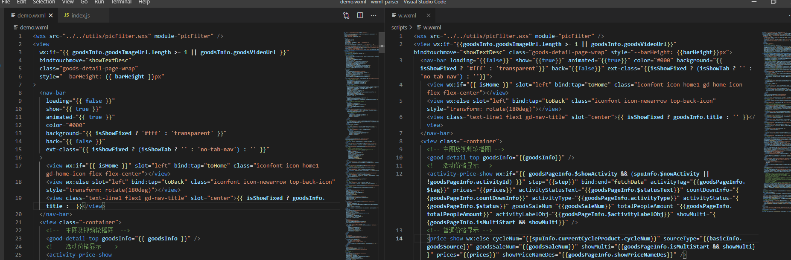

# wxml-parse
使用 原生js 对 wxml 字符串进行解析，生成相应的 AST，然后再转换成 wxml 字符串。

<a href="https://github.com/ma125120/wxml-parse">
  
</a>    

效果图如下：
左图为美化后的代码，右边为原图



生成为 wxml 时，
- text 文本的内容将不会进行换行，防止内容掉落。
- 子元素有多个时，会进行换行展示，
- 单个子元素并且为纯文本时，将不会换行展示
- wxs 标签会**检查** ```module``` 属性 和 内容的导出
- 标签未正确闭合时，将会抛出错误

## 安装
```cmd
npm i wxml-parse
```

## 使用
```js
import { parse, generate, traverse, NODE_TYPES } from "wxml-parse";

// <wxs>var a = '<wxs>'</wxs>
const ast = parse(
   `<view wx:if=" sda " bindtap="{{ sda }}">123</view><wxs module="sad">var a = '<wxs>';module.exports=123</wxs>` +
    `<!--wxml-->
  <template name="staffName">
    <view>
      FirstName: {{firstName}}, LastName: {{lastName}}
    </view>
  </template>

  <template is="staffName" data="{{...staffA}}"></template>
  ` +
    `
  <!--\${node.comment}-->

  <view wx:if="{{xsda}}" class="sda {{sda}}" id="123" name="sadasdsadasdsadasdsadasdsadasdsadasdsadasdsadasdsadasdsadasdsadasdsadasdsadasdsadasdsadasdsadasdsadasdsadasdsadasd\\"\\"" style="<view>view style</view>">

  <text id="123" name="sadasdsadasdsa" />

  <text>sads撒大苏打阿萨大<text>qqw的撒</text></text>
  </view>`
);

traverse(ast, {
  [NODE_TYPES.TEXT](node) {
    console.log(node);
  },
});

const str = generate(ast as any, {
  compress: false, // 是否压缩代码
  // maxWidth: 120，默认值
});

```

字符串str等于一下内容:
```html
<view wx:if="{{ sda }}" bindtap="sda">123</view>
<wxs module="sad">var a = '<wxs>';module.exports=123</wxs>
<!-- wxml -->
<template name="staffName">
	<view>FirstName: {{firstName}}, LastName: {{lastName}}</view>
</template>
<template is="staffName" data="{{ ...staffA }}"></template>
<!-- ${node.comment} -->
<view
	wx:if="{{ xsda }}"
	class="sda {{ sda }}"
	id="123"
	name="sadasdsadasdsadasdsadasdsadasdsadasdsadasdsadasdsadasdsadasdsadasdsadasdsadasdsadasdsadasdsadasdsadasdsadasdsadasd\"\""
	style="<view>view style</view>"
>
	<text id="123" name="sadasdsadasdsa" />
	<text>sads撒大苏打阿萨大<text>qqw的撒</text></text>
</view>
```

## 相关API
[基本类型文件](./src/lib/parse/type.ts)
### 1. parse
将 wxml 转换为 AST
```ts
const parse: (str: string) => RootNode
```

### 2. traverse
遍历 AST，需要自定义属性时，可使用该方法
```ts
// 1 3 8 均来自于 NODE_TYPES 类型
declare const fn: {
    1(node: ElementNode): void;
    3(node: TextNode): void;
    8(node: CommentNode): void;
    0(node: RootNode): void;
};
declare type VisitorFn = Partial<typeof fn>;
export declare function traverse(node: BaseNode | BaseNode[] | RootNode, visitor: VisitorFn): void;

```

### 3. generate
根据 AST 重新转换为 wxml字符串，可压缩或者美化
```ts
export declare type ConfigType = {
  compress?: boolean; // false 表示美化， true表示压缩
  maxWidth?: number; // 默认值 120, 元素属性大于该值时，将会换行
};
export declare const generate: (node: BaseNode | BaseNode[] | RootNode, config?: ConfigType) => any;

```
